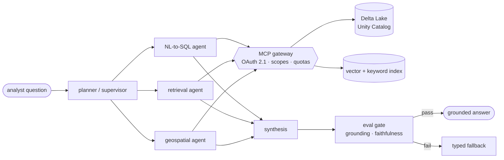

  

  
  
  
  

---

I build AI systems **past the prototype stage** — where latency, reliability, cost, and observability are the engineering problem, not a follow-up ticket.

Ten years in production systems (Java/Spring, Kafka, Kubernetes); the last four on agent orchestration, MCP-governed tool access, retrieval, and LLM evaluation. Now working a layer down: model serving, KV caching, continuous batching, quantization, distributed inference.

Currently lead architect of a **statewide disaster-intelligence platform** for Texas emergency management — analysts ask one question in English instead of querying five systems by hand.

---

## How I think about agents

Most agent failures aren't model failures. They're missing boundaries. So the interesting work sits in the layers around the model:

Every arrow above is a place to enforce something: a scope, a schema, a budget, a score. That's the job.

---

## Projects

<table>
<tr><td width="50%" valign="top">

### ⚙ GPU Inference Platform
OpenAI-compatible serving control plane — admission control, queueing, multi-model routing, SSE streaming, custom continuous-batching scheduler.

**~1,335 req/s** batched vs **~510** unbatched (~2.6×) on a mock backend that isolates scheduler behavior from GPU compute. Scaling sweeps and bottleneck reports ship with the numbers.

`Python` `FastAPI` `vLLM` `OpenTelemetry`

</td><td width="50%" valign="top">

### ⚙ Agentic AI Platform
Governed execution engine: plan → execute → validate → policy → approval, with typed tool contracts and durable, replayable runs.

Schema-bounded NL-to-SQL runs parameterized and read-only; query text, parameters, row counts, latency, and policy outcomes all persist as auditable tool calls.

`Python` `FastAPI` `Pydantic` `PostgreSQL`

</td></tr>
<tr><td width="50%" valign="top">

### ⚙ AutonomyOS
Mission-to-execution autonomy pipeline — planning, perception, inflated occupancy grids, A\* navigation, PyBullet execution, event-driven telemetry with replay in an operator UI.

`Python` `PyBullet` `FastAPI` `Angular`

</td><td width="50%" valign="top">

### ⚙ ModelOps Control Plane
Separates experiment namespaces from production, enforces explicit artifact promotion, preserves lineage, ties serving revisions to telemetry and rollback.

`Python` `MLflow` `Kubernetes`

</td></tr>
</table>

---

## Stack

<b>LLM infrastructure</b>

PyTorch · vLLM · SGLang · model serving · KV caching · continuous batching · quantization · distributed inference · request scheduling and admission control · inference benchmarking

<b>Applied AI</b>

LangGraph multi-agent orchestration · Model Context Protocol (FastMCP) · RAG and hybrid retrieval · reranking · NL-to-SQL · guardrails · LLM evaluation (golden datasets, LLM-as-judge, grounding and faithfulness scoring, MLflow regression gates) · LiteLLM · Databricks Model Serving

<b>Backend & distributed</b>

Python · Java · Go · Rust · TypeScript · FastAPI · Spring Boot · Node.js · Kafka · PostgreSQL · Redis · MongoDB · REST · gRPC · GraphQL · OAuth 2.1/OIDC · Keycloak · RBAC

<b>Data & platform</b>

Databricks · PySpark · Delta Lake · Unity Catalog · Airflow · BigQuery · Snowflake · H3 geospatial indexing · Kubernetes (GKE/EKS) · Docker · Terraform · AWS · GCP · Azure · OpenTelemetry · Prometheus · Grafana

---

## Writing

Essays on execution semantics, production LLM orchestration, and RAG failure modes — **[veerapareddy.dev](https://veerapareddy.dev)**

B.E. EEE, Anna University · Stanford AI Professional Program 2025 · NVIDIA Certified Professional: Agentic AI · Databricks Certified Generative AI Engineer Associate
