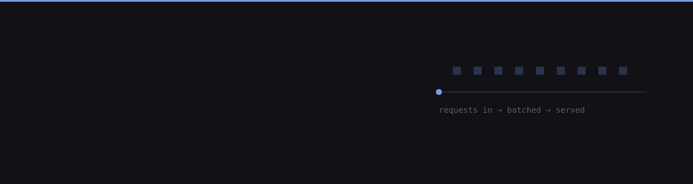
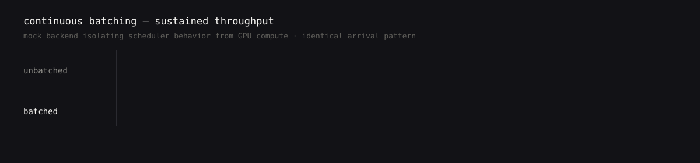
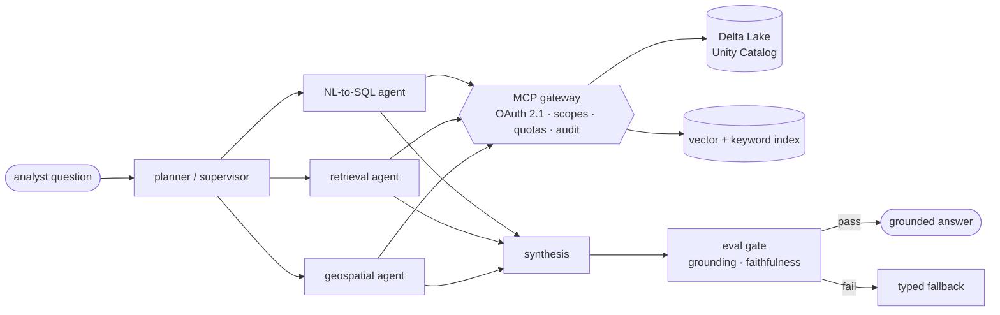
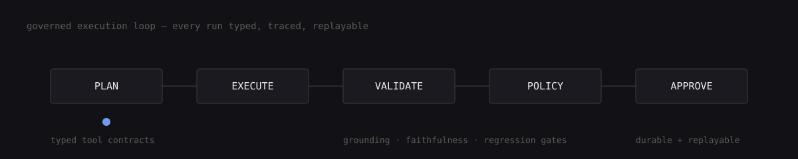

  

  
  
  
  

---

**I build AI systems past the prototype stage** — where latency, reliability, cost, and observability are the engineering problem, not a follow-up ticket.

Ten years in production systems (Java/Spring, Kafka, Kubernetes). The last four on agent orchestration, MCP-governed tool access, retrieval, and LLM evaluation. Now working a layer down: model serving, KV caching, continuous batching, quantization, distributed inference.

Day job: lead architect of a **statewide disaster-intelligence platform** for Texas emergency management — analysts ask one question in English instead of querying five systems by hand.

---

## Three things I believe about production LLM systems

**1 — Most "model failures" are missing boundaries.** The model didn't hallucinate a tenant's data; something let it see the row. Scopes, schemas, budgets, and filters belong *outside* the prompt.

**2 — If a change can't fail a gate, it isn't shippable.** Golden datasets per agent, grounding and faithfulness scoring, LLM-as-judge with human spot-checks, regression suites in MLflow enforced on every release — plus the same checks sampled online, because retrieval drifts even when nothing was deployed.

**3 — Throughput is a scheduling problem before it's a GPU problem.** Batching, admission control, and queue discipline move more numbers than another card does.

---

## The shape of the work

Every arrow is a place to enforce something. That's the job.

---

## Projects

<table>
<tr><td width="50%" valign="top">

### GPU Inference Platform
OpenAI-compatible serving control plane — admission control, queueing, multi-model routing, SSE streaming, and a custom continuous-batching scheduler.

Ships with scaling sweeps and rule-based bottleneck reports, so the **2.6×** above is reproducible rather than claimed.

`Python` `FastAPI` `vLLM` `OpenTelemetry` `Prometheus`

</td><td width="50%" valign="top">

### Agentic AI Platform
Governed execution engine: plan → execute → validate → policy → approval, with typed tool contracts and durable, replayable runs.

Schema-bounded NL-to-SQL runs parameterized and read-only; query text, parameters, row counts, latency, and policy outcomes persist as auditable tool calls. Deterministic fallback and replay modes backstop model failure.

`Python` `FastAPI` `Pydantic` `PostgreSQL`

</td></tr>
<tr><td width="50%" valign="top">

### AutonomyOS
Mission-to-execution autonomy pipeline — planning, metadata perception, inflated occupancy grids, A\* navigation, PyBullet waypoint execution, and event-driven telemetry replayed in a canvas operator UI.

`Python` `PyBullet` `FastAPI` `Angular`

</td><td width="50%" valign="top">

### ModelOps Control Plane
Separates experiment namespaces from production, enforces explicit artifact promotion, preserves lineage, and ties serving revisions to operational telemetry and rollback.

`Python` `MLflow` `Kubernetes`

</td></tr>
</table>

---

## Stack

<b>LLM infrastructure</b>

PyTorch · vLLM · SGLang · model serving · KV caching · continuous batching · quantization · distributed inference · request scheduling and admission control · inference benchmarking

<b>Applied AI</b>

LangGraph multi-agent orchestration · Model Context Protocol (FastMCP) · RAG and hybrid retrieval · reranking · NL-to-SQL · guardrails · LLM evaluation (golden datasets, LLM-as-judge, grounding and faithfulness scoring, MLflow regression gates) · LiteLLM · Databricks Model Serving

<b>Backend &amp; distributed</b>

Python · Java · Go · Rust · TypeScript · FastAPI · Spring Boot · Node.js · Kafka · PostgreSQL · Redis · MongoDB · REST · gRPC · GraphQL · OAuth 2.1/OIDC · Keycloak · RBAC

<b>Data &amp; platform</b>

Databricks · PySpark · Delta Lake · Unity Catalog · Airflow · BigQuery · Snowflake · H3 geospatial indexing · Kubernetes (GKE/EKS) · Docker · Terraform · AWS · GCP · Azure · OpenTelemetry · Prometheus · Grafana

---

## Writing

Essays on execution semantics, production LLM orchestration, and RAG failure modes — **[veerapareddy.dev](https://veerapareddy.dev)**

**Open to Senior/Staff roles** in AI Systems, LLM Infrastructure, ML Infrastructure, AI Platform, and Forward-Deployed AI Engineering — especially where AI meets real backend and distributed-systems work.

B.E. EEE, Anna University · Stanford AI Professional Program 2025 · NVIDIA Certified Professional: Agentic AI · Databricks Certified Generative AI Engineer Associate · Dallas, TX
